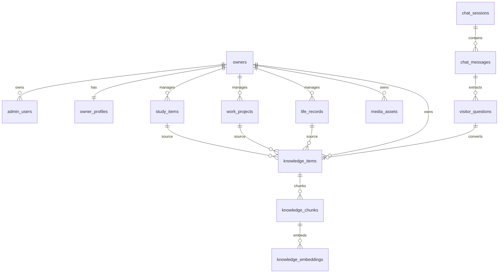

# 数据库架构与知识库设计

## 1. 数据库选择

推荐使用：

```text
PostgreSQL + pgvector
```

原因：

- 业务数据和向量数据可以在同一个数据库中管理。
- 适合 MVP 和中长期个人项目。
- 后续可以平滑迁移到独立向量数据库。
- 可通过 Row Level Security 强化数据隔离。

## 2. 数据域划分

系统数据分为 8 个域：

| 数据域 | 说明 |
|---|---|
| 身份与权限 | 管理员账号、会话、角色 |
| 个人资料 | 站点主人基础资料、联系方式、公开设置 |
| 内容资产 | 学习档案、工作项目、生活记录、图片素材 |
| 知识库 | 知识条目、知识分块、向量、来源映射 |
| 访客互动 | 聊天会话、聊天消息、访客反馈、联系意图 |
| 问题沉淀 | 访客问题、问题状态、转知识记录 |
| AI 配置 | 模型供应商、API Key、提示词、RAG 策略 |
| 审计日志 | 管理员操作、AI 调用、知识同步任务 |

## 3. 核心实体关系



## 4. 数据隔离设计

### 4.1 owner_id 隔离

所有业务表都包含：

```text
owner_id uuid not null
```

即使第一版只有你一个站点主人，也保留 `owner_id`，避免未来扩展时重构成本过高。

### 4.2 可见性隔离

核心内容表统一包含：

```text
visibility text not null default 'private'
status text not null default 'draft'
is_ai_usable boolean not null default false
is_public_indexable boolean not null default false
```

推荐枚举：

```text
visibility:
  public    公开展示
  unlisted  不在列表公开展示，但可直链访问
  private   仅管理员可见

status:
  draft      草稿
  published  已发布
  archived   已归档
```

### 4.3 AI 引用隔离

AI/RAG 检索不能只看 `visibility`，必须同时看：

```text
is_ai_usable = true
```

这样可以支持：

- 内容公开展示，但不允许 AI 引用。
- 内容私密保存，也不允许 AI 引用。
- 管理员调试时临时预览私密知识。

### 4.4 访客数据隔离

访客不需要注册。

建议使用：

```text
visitor_id: 匿名 UUID
session_id: 聊天会话 UUID
```

访客只能看到：

```text
公开页面返回的数据
自己的当前聊天会话
```

访客不能查询：

- 其他访客会话。
- 管理员数据。
- 原始知识库全文。
- 私密内容。

## 5. 知识库搭建方案

### 5.1 内容源

知识库来源类型：

| source_type | 来源 |
|---|---|
| `manual` | 手动录入 |
| `profile` | 个人资料 |
| `study_item` | 学习档案 |
| `work_project` | 工作项目 |
| `life_record` | 生活记录 |
| `visitor_question` | 访客问题沉淀 |
| `chat_summary` | 聊天总结 |

### 5.2 知识条目

`knowledge_items` 保存完整知识条目，适合后台编辑。

关键字段：

- 标题
- 分类
- 正文
- 标签
- 来源类型
- 来源 ID
- 可见性
- 是否可用于 AI
- 同步状态

### 5.3 知识分块

`knowledge_chunks` 保存用于检索的文本块。

分块原则：

- 每块 300-800 中文字左右。
- 保留标题、分类、标签、来源。
- 对学习、工作、生活记录分别保留 source metadata。
- 不把私密字段拼进 chunk。

### 5.4 向量表

`knowledge_embeddings` 保存向量。

字段：

- `chunk_id`
- `provider`
- `model`
- `dimension`
- `embedding`
- `embedded_at`

这样未来可以同时保存不同模型的向量：

```text
text-embedding-3-small
bge-m3
jina-embeddings
qwen-embedding
本地 embedding 模型
```

### 5.5 检索流程

```text
访客问题
  -> 生成 query embedding
  -> 按 owner_id / visibility / is_ai_usable 过滤
  -> 向量相似度召回 Top K
  -> 可选关键词召回补充
  -> 合并去重
  -> 重排序
  -> 组装 Prompt
  -> 调用 DeepSeek
  -> 保存回答和引用
```

## 6. 表设计概览

### 6.1 `owners`

站点主人/租户表。

字段：

- `id`
- `slug`
- `display_name`
- `created_at`

### 6.2 `admin_users`

后台账号。

字段：

- `id`
- `owner_id`
- `email`
- `password_hash`
- `role`
- `status`
- `last_login_at`

### 6.3 `owner_profiles`

个人基础资料。

字段：

- `owner_id`
- `nickname`
- `avatar_asset_id`
- `headline`
- `bio`
- `city`
- `tags`
- `contact_methods`
- `visibility`
- `is_ai_usable`

### 6.4 `media_assets`

图片和文件素材库。

字段：

- `id`
- `owner_id`
- `type`
- `url`
- `storage_key`
- `mime_type`
- `size_bytes`
- `width`
- `height`
- `alt_text`
- `tags`
- `visibility`

### 6.5 `study_items`

学习成长内容。

字段：

- `id`
- `owner_id`
- `type`
- `title`
- `summary`
- `body`
- `started_at`
- `ended_at`
- `tags`
- `visibility`
- `is_ai_usable`

### 6.6 `work_projects`

工作项目/作品集。

字段：

- `id`
- `owner_id`
- `title`
- `summary`
- `body`
- `role`
- `tech_stack`
- `result_summary`
- `project_url`
- `repo_url`
- `started_at`
- `ended_at`
- `visibility`
- `is_ai_usable`

### 6.7 `life_records`

生活记录信息流。

字段：

- `id`
- `owner_id`
- `title`
- `excerpt`
- `body`
- `occurred_at`
- `location_text`
- `mood`
- `tags`
- `visibility`
- `is_ai_usable`

### 6.8 `knowledge_items`

知识库条目。

字段：

- `id`
- `owner_id`
- `title`
- `category`
- `body`
- `tags`
- `source_type`
- `source_id`
- `visibility`
- `is_ai_usable`
- `sync_status`

### 6.9 `knowledge_chunks`

知识分块。

字段：

- `id`
- `owner_id`
- `knowledge_item_id`
- `chunk_index`
- `content`
- `token_count`
- `metadata`
- `visibility`
- `is_ai_usable`

### 6.10 `knowledge_embeddings`

知识向量。

字段：

- `id`
- `owner_id`
- `chunk_id`
- `provider`
- `model`
- `dimension`
- `embedding`

### 6.11 `chat_sessions`

访客聊天会话。

字段：

- `id`
- `owner_id`
- `visitor_id`
- `entry`
- `topic`
- `related_source_type`
- `related_source_id`
- `started_at`
- `ended_at`

### 6.12 `chat_messages`

聊天消息。

字段：

- `id`
- `owner_id`
- `session_id`
- `role`
- `content`
- `citations`
- `llm_provider`
- `llm_model`
- `prompt_tokens`
- `completion_tokens`

### 6.13 `visitor_questions`

访客问题沉淀。

字段：

- `id`
- `owner_id`
- `session_id`
- `message_id`
- `question`
- `answer`
- `topic`
- `status`
- `converted_knowledge_item_id`

### 6.14 `model_settings`

模型配置。

字段：

- `id`
- `owner_id`
- `chat_provider`
- `chat_base_url`
- `chat_model`
- `encrypted_api_key`
- `embedding_provider`
- `embedding_model`
- `temperature`
- `top_p`
- `max_tokens`

### 6.15 `prompt_templates`

提示词模板。

字段：

- `id`
- `owner_id`
- `scene`
- `name`
- `system_prompt`
- `style_rules`
- `safety_rules`
- `is_active`

## 7. 索引策略

必须索引：

```text
owner_id
visibility
status
is_ai_usable
source_type + source_id
created_at
tags
```

向量索引：

```sql
CREATE INDEX ON knowledge_embeddings
USING ivfflat (embedding vector_cosine_ops)
WITH (lists = 100);
```

MVP 阶段数据量小，也可以先不用 ivfflat，直接精确检索，等数据增长后再建向量索引。

## 8. 同步与任务状态

内容同步知识库状态：

```text
none       未同步
pending    等待同步
chunked    已分块
embedded   已向量化
failed     同步失败
```

典型流程：

```text
生活记录发布
  -> 判断 is_ai_usable
  -> 创建/更新 knowledge_item
  -> chunk
  -> embed
  -> 标记 embedded
```

## 9. 推荐数据保留策略

- 聊天记录默认长期保留，仅管理员可见。
- 访客联系方式可单独设置保留期限。
- 被忽略的问题仍可保留摘要，用于统计高频需求。
- 删除公开内容时，不立即硬删知识库，可先归档。
- 删除媒体资产前检查是否被生活记录或项目引用。

